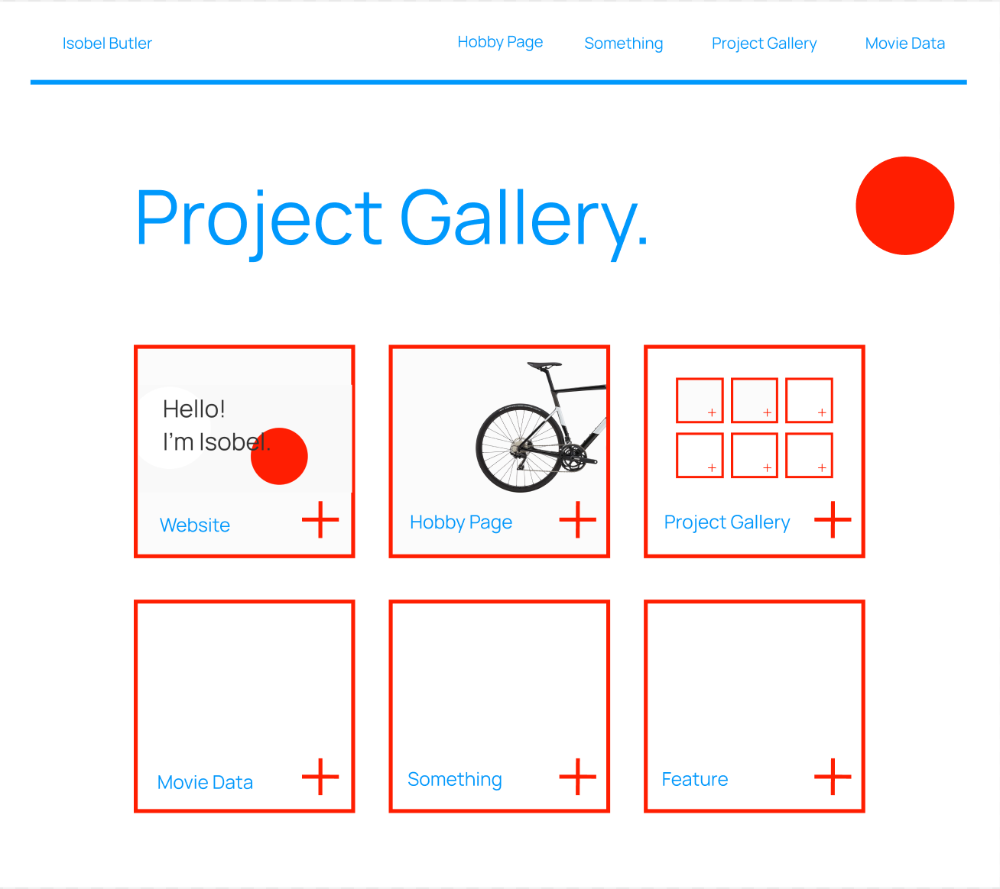
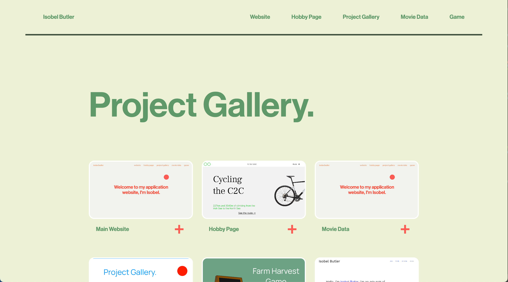

# Application Website

## Table of Contents
1. [Planning](#Planning) 
2. [Building](#Building)  
3. [Debugging](#Debugging)

## Planning

I wanted the project gallery to tie in with the main website but be a seperate page. I started by using the same colour palette and navbar as the application website and created a figma design that used alot of the strong red as the website, as shown below:

### Original Figma Design:



### Reworked Design (not on Figma):
After the site was built I decided I wanted to move away from the same style as the main website as I felt like it was an oppportunity to play with different colour so I made a new design:  



After these redesigns I ended up deciding that I wanted the gallery to be part of the main application website as it felt like it made sense there, so I moved over the files and merged the styling.

## Building

1. Replicate the Figma design using HTML and CSS.
2. Create a JavaScript object containing all the data for the project gallery: image, project, link, and caption.
3. Create a loop to render the object onto the page, in a flexbox layout.
4. Create captions that show/hide upon clicking the plus symbol.
5. Redo the design.
6. Merge into the main application website.

## Debugging

### Issue: Getting the dropdown button to loop through all the individual cards.
This was my first real experience of using JavaScript 

**Original code:**
```html

```

**Solution:**  


```css
  
```
### Issue: Getting the gallery section height to not be increased by the navbar.

**Solution:**  
```css
 section:first-child {
    min-height: calc(100vh - 100px); /* means first section height isn't increased by navbar - very sexy */
  }
```